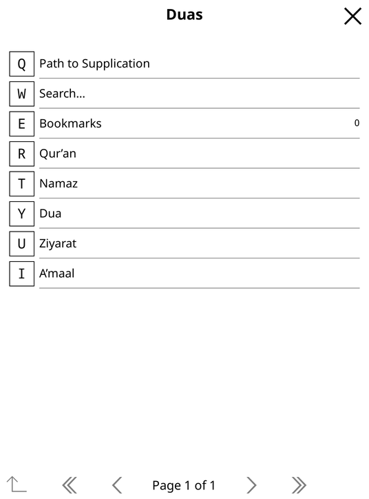
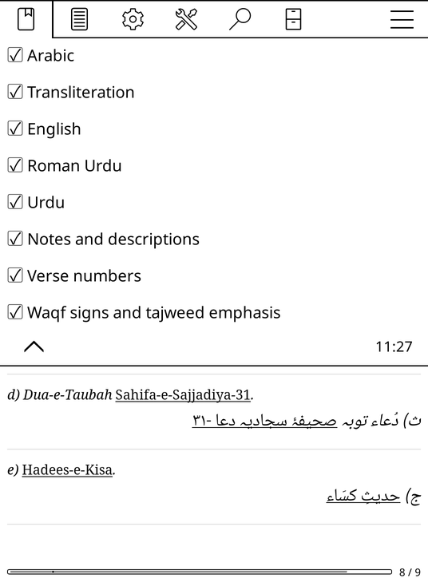

# RONkindle: Duas for KOReader

A [KOReader](https://github.com/koreader/koreader) plugin for reading the *Path to Supplication* collection on a Kindle or any other device that runs KOReader. The collection covers the Qur'an, Namaz, Dua, Ziyarat and A'maal.

<p>




</p>

## Features
- **Show and hide parts while reading.** Switch Arabic, transliteration, English, Roman Urdu, Urdu, notes, verse numbers and waqf signs on or off. The page restyles in place and keeps your position. Each switch can also be assigned to a gesture.
- **Browse like the app.** Categories, sections and entries come with breadcrumbs, previous/next links and the *Path to Supplication* shortcuts.
- **Links work.** 8,518 cross-references are tappable, and references like `Aale Imran (3:18-19)` jump to the verse.
- **Search every language.** English, Roman Urdu, Urdu, transliteration and Arabic are all searchable, and Arabic and Urdu match without harakat. Each result shows a snippet, and tapping it jumps to the line.
- **Bookmarks.** Hold an entry or use the menu to save it to a list. KOReader's own bookmarks, highlights and notes also work inside pages.
- **Light on the device.**
  - Everything is pre-rendered on your computer.
  - The device only loads the page you open.
  - Long surahs and duas are split into parts of about 60 KB.
  - The database is closed while you read.

## Install
Requirements: a device running KOReader, such as a jailbroken Kindle, Kobo or PocketBook.

1. Download `duas-kindle-<version>.zip` from the [releases](../../releases), or build it yourself (see below).
2. Connect the device over USB and unzip the file at the top level of its drive. It merges into the existing `koreader/` folder, adding:
   - `koreader/plugins/duas.koplugin/`, the plugin;
   - `koreader/duas/duas.sqlite`, the content.
3. Restart KOReader.

## Use
- **Open it:**
  - from the file browser: **Tools (⚙) → Duas**;
  - while reading a page: **Navigation (☰) → Duas**.
- **Browse:** tap a category, then a section, then an entry. Press and hold an entry to bookmark it.
- **Show:** tick the parts you want to see. At least one of Arabic, transliteration or a translation always stays on.
- **Long pages** come in parts, with **‹ Part 1 · Part 2 of 9 · Part 3 ›** links at the top and bottom. Links, search results and bookmarks open the right part.
- **Search…** matches every word you type as the start of a word, for example "kum" finds "Kumail".
- **Install Amiri Arabic font (optional):** Amiri is more calligraphic. KOReader's built-in Noto Naskh is lighter and cleaner.
- **Gestures:** go to **Settings → Taps and gestures → Gesture manager**, pick a gesture, then **General**, and choose any *Duas: …* action. These include browse, search, bookmarks, Path to Supplication and each show/hide switch.

## Build it yourself
The content comes from `ron.db`, the database of the *Path to Supplication* app, which is included in this repository. You need only Python 3.
```bash
python3 scripts/build_kindle_db.py ron.db duas.sqlite   # about 15 s, about 30 MB
tools/package.sh                                        # the release zips, in dist/
```
Options and behaviour:
- **Hidden entries:** entries the app hides from its index (`IsVisible = 0`) are hidden here too, but links and search still open them. `--include-hidden` lists them when browsing as well.
- **Verse numbers:**
  - Qur'an pages use the source's own verse numbers.
  - Numbered instructions show as "1.", "2." and so on.
  - Other pages number every Arabic line that isn't a heading.

## Performance
Measured in KOReader v2026.07.2 on a virtual greyscale screen of 1072×1448 at 300 dpi, with KOReader limited to 10% of one desktop CPU core (see [docs/DEVELOPMENT.md](docs/DEVELOPMENT.md)):

| Operation | Time |
|---|---|
| Open the browser | 0.5 s |
| Open Baqarah, the longest page (part 1 of 9) | 1.5 s |
| Hide or show a language on that page | 0.4–0.5 s |
| Search, even for a very common word | 0.1 s or less |
| Jump to a verse in another part | 1.5 s |

## Development
See [docs/DEVELOPMENT.md](docs/DEVELOPMENT.md) for:
- how it works;
- the database format;
- the tests, both off-device and inside a real KOReader;
- benchmarks and how to make a release.

## Licence
- **Code:** [AGPL-3.0](LICENSE), the same as KOReader.
- **Content** in `ron.db`: not covered by that licence; it belongs to its owners.
- **Amiri font:** SIL Open Font License.

Details are in [NOTICE.md](NOTICE.md).
